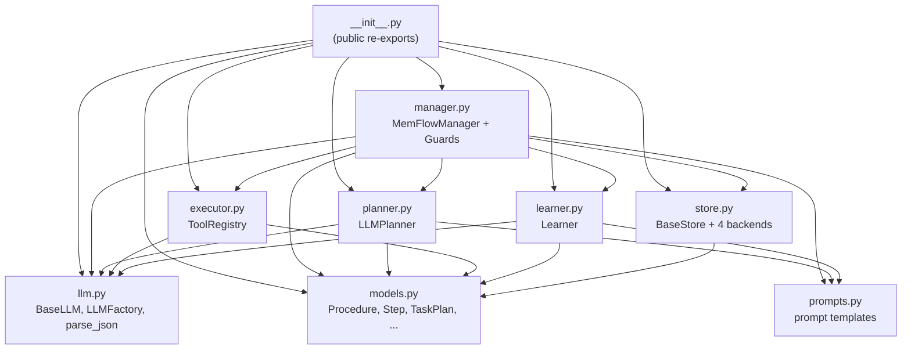

# MemFlow — Module Architecture

High-level dependency graph of the `memflow/` package. Edges point from importer to imported.

## Layered view (ASCII)

```
┌──────────────────────────────────────────────────────────────────────┐
│                  __init__.py  (public surface — re-exports)          │
└──────────────────────────────────────┬───────────────────────────────┘
                                       │
                                       ▼
┌──────────────────────────────────────────────────────────────────────┐
│                          manager.py                                  │
│  MemFlowManager  +  GlobalGuard / PlanGuard / ToolGuard              │
│  add · search · chat · plan · execute · run                          │
└────┬──────────────┬─────────────┬─────────────┬──────────────┬───────┘
     │              │             │             │              │
     ▼              ▼             ▼             ▼              ▼
┌──────────┐  ┌──────────┐  ┌──────────┐  ┌──────────┐  ┌────────────┐
│ planner  │  │ executor │  │ learner  │  │  store   │  │  prompts   │
│LLMPlanner│  │ToolReg-  │  │ Learner  │  │BaseStore │  │ (strings)  │
│          │  │  istry   │  │          │  │+4 backs  │  │            │
└────┬─────┘  └────┬─────┘  └────┬─────┘  └────┬─────┘  └────────────┘
     │  prompts    │             │  prompts    │
     │             │             │             │
     ▼             ▼             ▼             ▼
┌──────────────────────────────────┐  ┌──────────────────────────────┐
│             llm.py               │  │           models.py          │
│ BaseLLM · OllamaLLM ·            │  │ Procedure · SearchResult     │
│ OpenAICompatibleLLM · LLMFactory │  │ Step · StepResult · StepType │
│ parse_json()                     │  │ TaskPlan · RunResult         │
└──────────────────────────────────┘  └──────────────────────────────┘
   (no intra-package imports)            (no intra-package imports)
```

## Layered view (Mermaid)



## Per-module dependency edges

| Module | Depends on |
|---|---|
| `models.py` | — (leaf) |
| `prompts.py` | — (leaf) |
| `llm.py` | — (leaf; uses `ollama` / `openai` SDKs lazily) |
| `store.py` | `models` |
| `executor.py` | `llm`, `models` |
| `planner.py` | `llm`, `models`, `prompts` |
| `learner.py` | `llm`, `models`, `prompts` |
| `manager.py` | `executor`, `learner`, `llm`, `models`, `planner`, `prompts`, `store` |
| `__init__.py` | re-exports everything |

## Runtime data flow (overlay on the static graph)

```
   ┌─────────────────────────────────────────────────────────────┐
   │                     run(task)  on Manager                   │
   └─────────────────────────────────────────────────────────────┘
        │           │              │              │
        ▼ Retrieve  ▼ Plan         ▼ Execute      ▼ Learn
    store.search → planner.plan → executor      → learner.extract
        │              ▲              │                 │
        │              │ context      │                 │ store.add
        └──────────────┘              ▼                 ▼
        (Retrieve→Plan back-edge)  StepResult     (Learn→Retrieve back-edge)
```

## External integrations — MemMachine

MemMachine is an external memory server (separate process, separate codebase) that holds three memory types under a single HTTP API:

| Memory type | What it holds | MemMachine backend |
|---|---|---|
| **procedural** | ordered steps, workflows, SOPs | VectorDB |
| **semantic** | facts, definitions, current state | VectorDB |
| **episodic** | time-anchored events | GraphDB |

MemFlow itself only models the *procedural* layer. Integration with MemMachine exists so an agent can keep all three memory types behind one MemFlow `add()` call without standing up a second system.

### Two integration points (`memflow/store.py`)

Both classes lazily `import memmachine_client` on first use, so the dependency is optional.

| Class | Role | Interface |
|---|---|---|
| `MemMachineStore` | Procedural backend (`MEMFLOW_BACKEND=memmachine`) | full `BaseStore`: `add` / `search` / `get` / `delete` / `list_all` |
| `MemMachineBypass` | Write-only sink for non-procedural content | single method: `add(content, memory_type, user_id)` |

`MemMachineStore` filters reads by metadata tag `mm_type="procedural"` so its records can coexist with semantic/episodic records in the same MemMachine project. It maintains an in-memory `procedure.id → episode_id` index for O(1) deletes (populated as a side-effect of `add()` and `search()`; on a delete cache-miss, `list_all()` hydrates it). All metadata values are stringified — MemMachine requires string-typed metadata. Connection is lazy and thread-safe under `self._lock`.

`MemMachineBypass` is *write-only* and is **not** a `BaseStore`. There is no MemFlow-side search for non-procedural content; once written, you query MemMachine through its own client.

### Classification → routing flow

```
manager.add(messages=...)
        │
        ▼
  _classify_memory_type(content)         ── LLM ──► procedural | semantic | episodic | none
        │
        ├── procedural ──► EXTRACTION_PROMPT ──► store.add(Procedure)
        │
        ├── semantic  ─┐
        │              ├──► bypass.add(content, type, user_id) ──► MemMachine VectorDB/GraphDB
        ├── episodic  ─┘
        │
        └── none ──────► dropped ({"skipped": "classified as none"})
```

The classifier is `manager._classify_memory_type()`, driven by `prompts.CLASSIFICATION_PROMPT`. Bypass failures are swallowed (`except Exception: pass`) — non-procedural storage is best-effort.

### Auto-wiring matrix (`MemFlowManager.__init__`)

When `use_env=True` and no explicit `bypass=` is passed:

| `MEMFLOW_BACKEND` | `manager.store` | `manager._bypass` | Fate of non-procedural content |
|---|---|---|---|
| `emulated` | `EmulatedStore` | `None` | dropped (`{"skipped": ...}`) |
| `file` | `FileStore` | `None` | dropped |
| `memmachine` | `MemMachineStore` | `MemMachineBypass(...)` | written to MemMachine |
| `pgvector` | `PgVectorStore` | `MemMachineBypass(..., pgvector_store=that_store)` | written to MemMachine |

In `pgvector` mode you still need a MemMachine server for semantic/episodic content — pgvector handles only procedural.

The `pgvector_store=` arg on `MemMachineBypass` is a hybrid-mode hook: when `MemMachineBypass.add()` is called with `memory_type="procedural"`, it writes to the local `PgVectorStore` instead of MemMachine. **`MemFlowManager` never exercises this path** — it routes procedural content through `store.add()` directly and only forwards `semantic`/`episodic` to the bypass. The injection is reserved for direct standalone use of `MemMachineBypass` outside the manager.

### Configuration (`.env`)

```ini
MEMMACHINE_BASE_URL=http://localhost:8080   # server URL
MEMMACHINE_ORG_ID=default                   # tenant
MEMMACHINE_PROJECT=memflow                  # project namespace within the org
MEMMACHINE_API_KEY=                         # optional auth
```

These vars feed both `MemMachineStore` (when backend is `memmachine`) and the auto-wired `MemMachineBypass` (when backend is `memmachine` or `pgvector`). Python dependency: `memmachine-client>=0.3.0`, installed via `uv sync --all-extras`.

## Observations

- **`models` and `prompts` are pure leaves** — both safe to import from anywhere with zero risk of cycles.
- **`llm` is also a leaf**: it has no intra-package imports, so the four "service" modules (`store`, `executor`, `planner`, `learner`) can each pull `BaseLLM` without dragging the orchestrator in.
- **`store` is the odd one out among the services** — it depends only on `models`, not on `llm`. That keeps the storage backends embedding-provider-agnostic; `PgVectorStore` calls its embedding API via raw HTTPX rather than going through `BaseLLM`.
- **`manager.py` is the only fan-out hub** — every other module has at most three internal imports. This is what makes the four-stage loop testable in isolation: `LLMPlanner`, `ToolRegistry`, `Learner`, and each store backend can be unit-tested with a `FakeLLM` and never touch the manager.
- **MemMachine integration uses two complementary classes, not one** — `MemMachineStore` (full `BaseStore`, procedural-only) and `MemMachineBypass` (single-method write-only sink for semantic/episodic). The split keeps the `BaseStore` contract narrow while still giving the manager a place to forward content the procedural layer doesn't model.
- **No cycles**, and no module reaches "up" — `manager` is the topmost non-`__init__` node.
